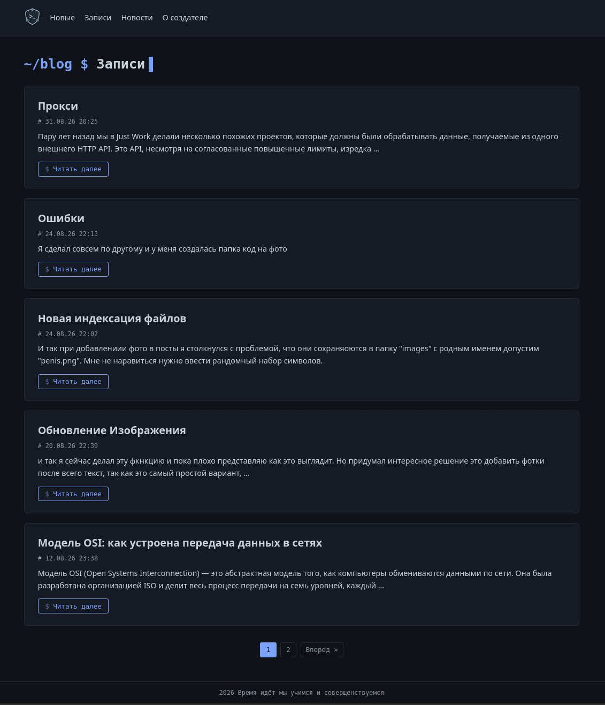

# Blog_Django

Небольшой пет-проект на фреймворке Django. Главная цель — создать рабочий сайт, а также изучить фреймворк, базы данных и основы веб-безопасности.

## Модальное окно

Было реализовано модальное окно с целью сделать внешнмий вид красивым и проктичным, а также чтобы страницы были меньше.

## Новости 
Теперь добавлены в отдельной вкладки, представлят небольшое сообщение

## Файлы 
В постах теперь их можно доболять, а просматривающий может его скачать(сыпая функция тет огранчения и типы загружаемых файлов)

## Палигация
Добалина полигация для страниц

## Редизайн в стиле Linux
Полностью преработан дизайн сайта(содержание на изображение тестовое) 

